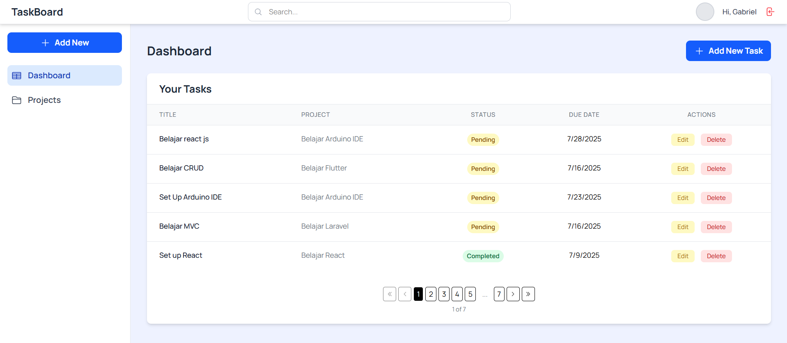
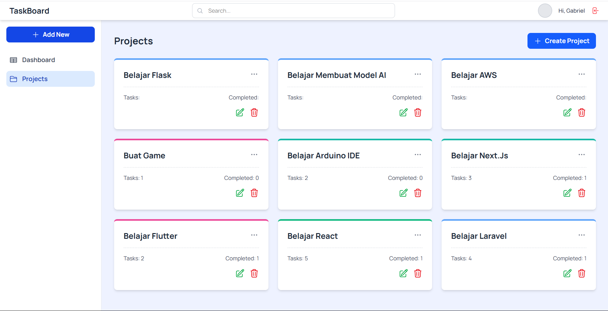

## License

This project is open-source and available under the [MIT License](LICENSE).

## 🚧 Development Status

This project is currently under active development. The core features are already working well, and additional features are planned for future updates. Feel free to give suggestions or contribute if you're interested!

# Task Manager Fullstack App

This Task Manager application is a full-stack project built using Laravel (backend API) and React (frontend), with authentication via Firebase. It is designed to manage tasks and projects efficiently.

## ✨ Main Features

- **User Authentication**: Register and login using Firebase Authentication.
- **Task Management (CRUD)**: Create, Read, Update, and Delete tasks.
- **Project Management (CRUD)**: Create, Read, Update, and Delete projects.
- **Task & Project Relationship**: Tasks can be linked to specific projects, with a “Not in any project” option.
- **Optimistic UI Updates**: Task and project operations feel instant with animated feedback, even before server confirmation.
- **Advanced Caching with React Query**: Tasks and projects are cached intelligently to prevent unnecessary refetching.
- **Pagination**: Tasks inside dashboards use client-side pagination for better UX and performance.
- **Global Search**: The top search bar filters tasks and projects across different pages.
- **Detailed Modal Views**: Task detail can be viewed in an interactive modal with full styling.
- **Dynamic Task Count Sync**: Task counts and completed counts update automatically between Dashboard and Project view.

---

## ⚙️ Prerequisites

Make sure the following software is installed on your system:

- **Laragon**: (Recommended for Windows) Local development environment including Apache, MySQL, and PHP.
- **PHP**: Version 8.2 or higher.
- **MySQL**: Version 8.0 or higher.
- **Composer**: Dependency manager for PHP.
- **Node.js**: Version 20.19.0 or higher (Latest LTS recommended).
- **npm**: Comes with Node.js.
- **Git**: Version control system.
- **Code Editor**: (VS Code recommended).

> ⚠️ If using Laragon, ensure your terminal prioritizes the Laragon's Node.js version in PATH.

---

## 🔐 Firebase Project Setup

This app uses **Firebase Authentication** for user management.

### 1. Create New Firebase Project

- Go to [Firebase Console](https://console.firebase.google.com/)
- Click "Add project" and follow the steps. Name your project (e.g., `task-manager-app-yourname`).
- You may disable Google Analytics for simplicity.

### 2. Enable Email/Password Authentication

- In your Firebase Console, navigate to **Build > Authentication**.
- Go to the **Sign-in method** tab.
- Enable **Email/Password** sign-in method.
- **Important**: Click **Save**.

### 3. Get Firebase Credentials (Client-side)

- Go to **Project Settings** (gear icon).
- Scroll down to **Your apps**.
- Click the **Web (</>)** icon to register a web app.
- You'll get a `firebaseConfig` object.
- Copy the values: `apiKey`, `authDomain`, `projectId`, `storageBucket`, `messagingSenderId`, `appId`.

### 4. Get Firebase Credentials (Server-side - Service Account)

- Go to **Project Settings > Service accounts**.
- Click **Generate new private key**, confirm and download the `.json` file (e.g., `yourproject-firebase-adminsdk-xxxxx.json`).
- Keep this file **secure**.

---

## 📦 Installation and Setup

This is a **monorepo**: Laravel (backend) and React (frontend) are in the same Git repo.

### 🧬 Clone the Repository

```bash
git clone https://github.com/GabrielNathanael/Task-Manager-Fullstack-App.git
cd Task-Manager-Fullstack-App
```

---

## 🔧 Backend Setup (Laravel)

### 1. Enter Backend Directory

```bash
cd task-manager-backend
```

### 2. Install Composer Dependencies

```bash
composer install
```

### 3. Setup `.env` File

```bash
cp .env.example .env
```

Edit `.env` in your code editor.

### 4. Generate Laravel App Key

If `APP_KEY` is empty, run:

```bash
php artisan key:generate
```

### 5. Configure MySQL Database

Adjust these values in `.env`:

```env
DB_CONNECTION=mysql
DB_HOST=127.0.0.1
DB_PORT=3306
DB_DATABASE=task_manager_db
DB_USERNAME=root
DB_PASSWORD=
```

> ⚠️ Create the database manually in MySQL first (e.g., via phpMyAdmin or MySQL CLI).

### 6. Setup Firebase Credentials (Server-side)

- Move the downloaded Firebase service account JSON file to:

```
task-manager-backend/storage/app/firebase/
```

- Update these lines in `.env`:

```env
FIREBASE_CREDENTIALS=firebase/your-firebase-adminsdk.json
FIREBASE_PROJECT_ID=your-firebase-project-id
```

### 7. Run Database Migrations

```bash
php artisan migrate:fresh --seed
```

> This will wipe existing tables and re-seed fresh data.

✅ Backend is now ready.

---

## 🖼 Frontend Setup (React)

### 1. Return to Project Root

```bash
cd ..
```

### 2. Enter Frontend Directory

```bash
cd task-manager-frontend
```

### 3. Install npm Dependencies

```bash
npm install
```

### 4. Install Additional UI Libraries

The app uses:

- `lucide-react` for icons.
- `@tanstack/react-table` for table views.
- `@tanstack/react-query` for caching and async state.
- `framer-motion` and `react-intersection-observer` for animations.

To ensure smooth UI, install them if not already present:

```bash
npm install lucide-react @tanstack/react-query @tanstack/react-table framer-motion react-intersection-observer
```

---

### 5. Tailwind CSS v4 Setup

Follow the official Tailwind CSS v4 + Vite installation guide:

👉 [https://tailwindcss.com/docs/installation/using-vite](https://tailwindcss.com/docs/installation/using-vite)

---

### 6. Setup `.env.local`

```bash
cp .env.example .env.local
```

Edit `.env.local` in your code editor with your Firebase config:

```env
VITE_FIREBASE_API_KEY="YOUR_API_KEY"
VITE_FIREBASE_AUTHDOMAIN="YOUR_PROJECT_ID.firebaseapp.com"
VITE_FIREBASE_PROJECTID="YOUR_PROJECT_ID"
VITE_FIREBASE_STORAGEBUCKET="YOUR_PROJECT_ID.appspot.com"
VITE_FIREBASE_MESSAGINGSENDERID="YOUR_MESSAGING_SENDER_ID"
VITE_FIREBASE_APPID="YOUR_APP_ID"
VITE_API_URL="http://localhost:8000/api"
```

✅ Frontend is now ready.

---

## 🚀 Running the App

### 1. Start Backend Server (Laravel)

```bash
cd task-manager-backend
php artisan serve
```

### 2. Start Frontend Server (React)

Open a new terminal:

```bash
cd task-manager-frontend
npm run dev
```

---

## 🌐 Access the Application

Open your browser and go to:

```
http://localhost:5173/
```

You'll see the **Login page**. You can register a new account or login with existing credentials.

---

## 📸 Screenshots




